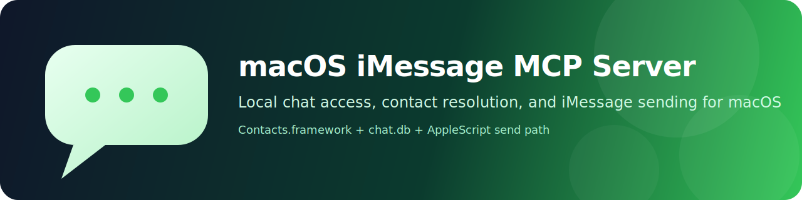

# macOS iMessage MCP Server

[](https://www.apple.com/macos/)
[](https://modelcontextprotocol.io/)
[](#quickstart)
[](#quickstart)

Local MCP server for macOS Messages.

This server gives an MCP client local access to your Messages data on macOS.

It is meant to let an agent:

- search contacts
- resolve names onto chats and message senders
- list recent conversations
- read message history
- search messages
- inspect unread chats
- send iMessages

Under the hood it uses:

- `Contacts.framework` for contact lookup
- `~/Library/Messages/chat.db` for reading chats and messages
- AppleScript for sending through the Messages app

## Quickstart

1. Open the Messages app and make sure you are signed in.
2. Open `System Settings > Privacy & Security > Full Disk Access` and enable it for the app that runs this MCP server.
3. Open `System Settings > Privacy & Security > Contacts` and enable Contacts access for the app that runs this MCP server.
4. If macOS prompts for automation permission when sending, allow the host app to control `Messages`.
5. Fully quit and reopen the host app after changing permissions.
6. Install and build the server:

```bash
npm install
npm run build
```

7. Configure your MCP host to run:

```bash
node /absolute/path/to/build/index.js
```

After that, the MCP client should be able to read chats, resolve contacts, and send iMessages from this Mac.
